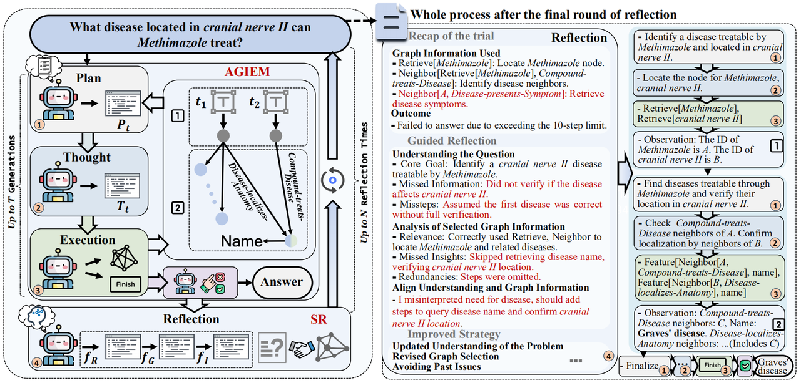

<div align="center">
   
## Graph Counselor: Adaptive Graph Exploration via Multi-Agent Synergy 
🏆 **ACL 2025 Main Conference Paper**  

[](https://arxiv.org/pdf/2506.03939)

_Junqi Gao <sup>1,2</sup>, Xiang Zou <sup>2</sup>, Ying Ai <sup>3</sup>, Dong Li <sup>1,2,†</sup>, Yichen Niu <sup>3</sup>, Biqing Qi <sup>1,†</sup>, Jianxing Liu <sup>3</sup>_

<sup>1</sup> _Shanghai Artificial Intelligence Laboratory_

<sup>2</sup> _School of Mathematics, Harbin Institute of Technology_

<sup>3</sup> _Department of Control Science and Engineering, Harbin Institute of Technology_

_<sup>†</sup> Corresponding Authors_



</div>

### ✨ Key Features

🧠 Multi-Agent Synergy: Planning, Thought, and Execution agents for optimized reasoning

🌐 Adaptive Graph Exploration: Dynamic retrieval strategies for complex knowledge graphs

🔍 Self-Reflection: Multi-perspective analysis for improved accuracy


### ⚙️ Installation
```bash
conda create -n graphcounselor python=3.8.1
conda activate graphcounselor
conda install pytorch1.12.1 torchvision0.13.1 torchaudio==0.12.1 cudatoolkit=11.3 -c pytorch
conda install -c pytorch -c nvidia faiss-gpu=1.7.4
conda install -c conda-forge langchain0.1.0 langchain-core0.1.7 langchain-community==0.0.9
conda install -c conda-forge openai1.6.1 scikit-learn1.3.2 sentence-transformers==2.2.2
conda install -c conda-forge transformers4.36.2 datasets2.16.1
conda install jsonlines tiktoken networkx IPython
pip install evaluate absl-py rouge_score
```
### 🚀 Quick Start

1. Download graph data [here](https://drive.google.com/drive/folders/1DJIgRZ3G-TOf7h0-Xub5_sE4slBUEqy9?usp=share_link) and save to data/processed_data/{data_name}

2. Run Graph Counselor:
   ```bash scripts/run_Graph-Counselor.sh```
3. Evaluation:
   ```bash eval.sh```


### 📚 Citation
```
@article{gao2025graphcounselor,
  title={Graph Counselor: Adaptive Graph Exploration via Multi-Agent Synergy},
  author={Junqi Gao and Xiang Zou and Ying Ai and Dong Li and Yichen Niu and Biqing Qi and Jianxing Liu},
  journal={arXiv preprint arXiv:2506.03939},
  year={2025},
  url={https://arxiv.org/abs/2506.03939}
}
```

